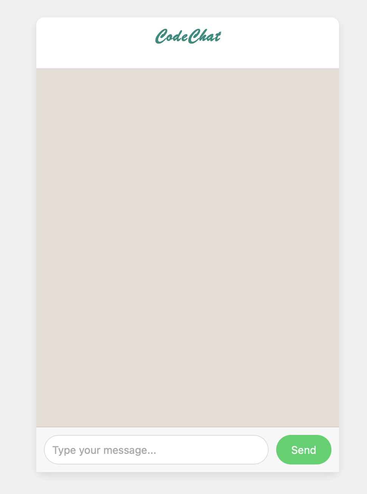
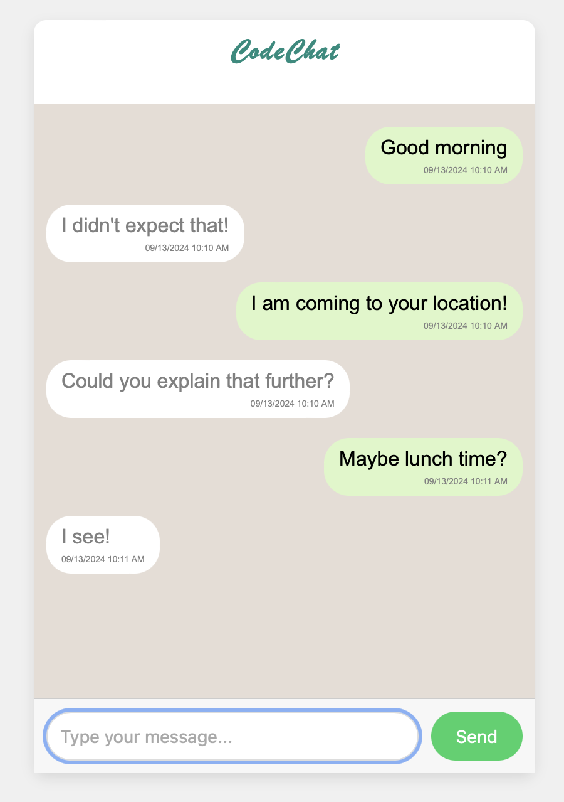

# ChatApp

This is a simple chat app with the following goals:

- i) send a message 
- ii) receive an automatic, random response 
- iii) display date and timestamp for reach message

## content
This repository contains three files:

- ```index.html``` : contains the HTML code
- ```style.css``` : ccontains the styling for formating the HTML
- ```logic.js``` : contains the Javascript code to control the apps functionality


## Screenshot

The first image shows the initial user interface before interaction, and the second image displays the interface after some interactions.

<p align="center">
    
    
</p>

## License
Permission is hereby granted, free of charge, to any person obtaining a copy of this chat app.
